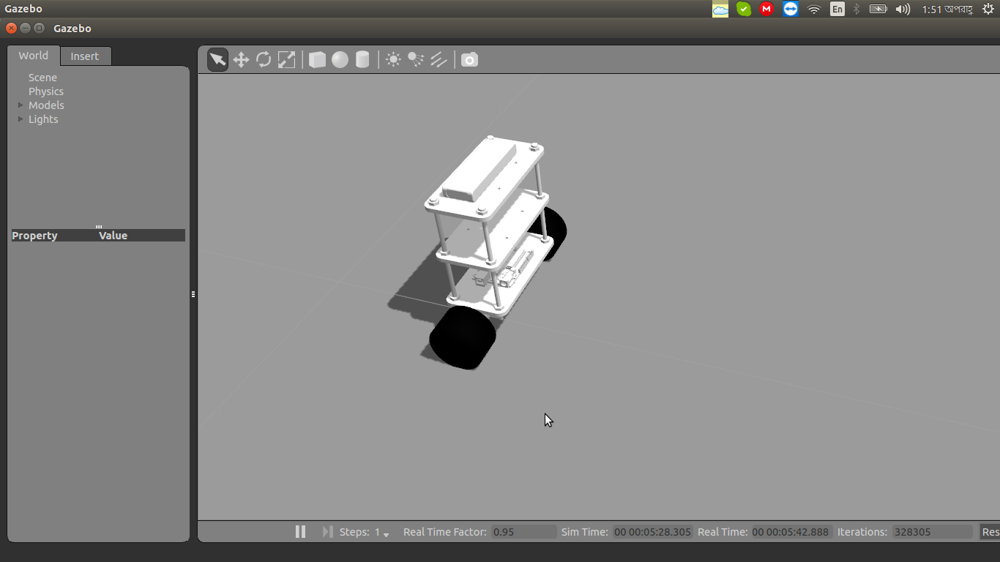

## Self Balancing Robot Simulation using ROS and Gazebo


### Paper

[DOI link](https://aip.scitation.org/doi/10.1063/1.5044373)
 

### Video 
The youtube link of videos are given in the notebook files. They can be accessed from [PID](https://www.youtube.com/watch?v=kssD8unnWls), [Fuzzy](https://www.youtube.com/watch?v=FoG59xl2c9I) and [LQR](https://www.youtube.com/watch?v=QmrRNw043dY) respectively.

In this project I have build a Self Balancing Robot Simulation in Gazebo.
The files are structured as following


### Notebook Folder
It has two jupyter notebook files . One contains the Description of Robot Model development named ```Self Balancing Robot.ipynb``` . The ```Controllers.ipynb``` describes the testing of the controllers, with Videos.

#### Video 
The video folder inside the notebook folder contains the videos of the project

### Src Folder
The $Src$ folder contains the source codes for the project. The file ```SelfBalance.py``` shows PID, ```SelfBalance_withFuzzy.py``` shows the Fuzzy P controller implementation and ```SelfBalance_withLQR.py``` shows the LQR implementation.

### Launch Folder
The launch folder contains the launch files
First download the github repository in your catkin workspace, and compile the project by writing catkin_make in the terminal. 
Then cd to the src folder of repository and write in the terminal ``` chmod +x *.py"```
Then for PID 
```
roslaunch self_balancing_robot main.launch
```
For Fuzzy Controller

```
roslaunch self_balancing_robot main_Fuzzy.launch
```

For LQR Controller

```
roslaunch self_balancing_robot main_LQR.launch
```

For any feedbacks and or suggestions , please contact sezan92@gmail.com


### Update 29 July 2018

#### DQN
For Deep Q Network control
```roslaunch self_balancing_robot main_no_control.launch```
For running the code of DQN, go to ```Notebook/SelfBalanceDeepRLQ.ipynb``` and run

#### Paper link
Paper [link](https://arxiv.org/pdf/1807.08272.pdf)
#### Video
[Video link](https://www.youtube.com/watch?v=OU7jb2B4L-c&t=712s)

